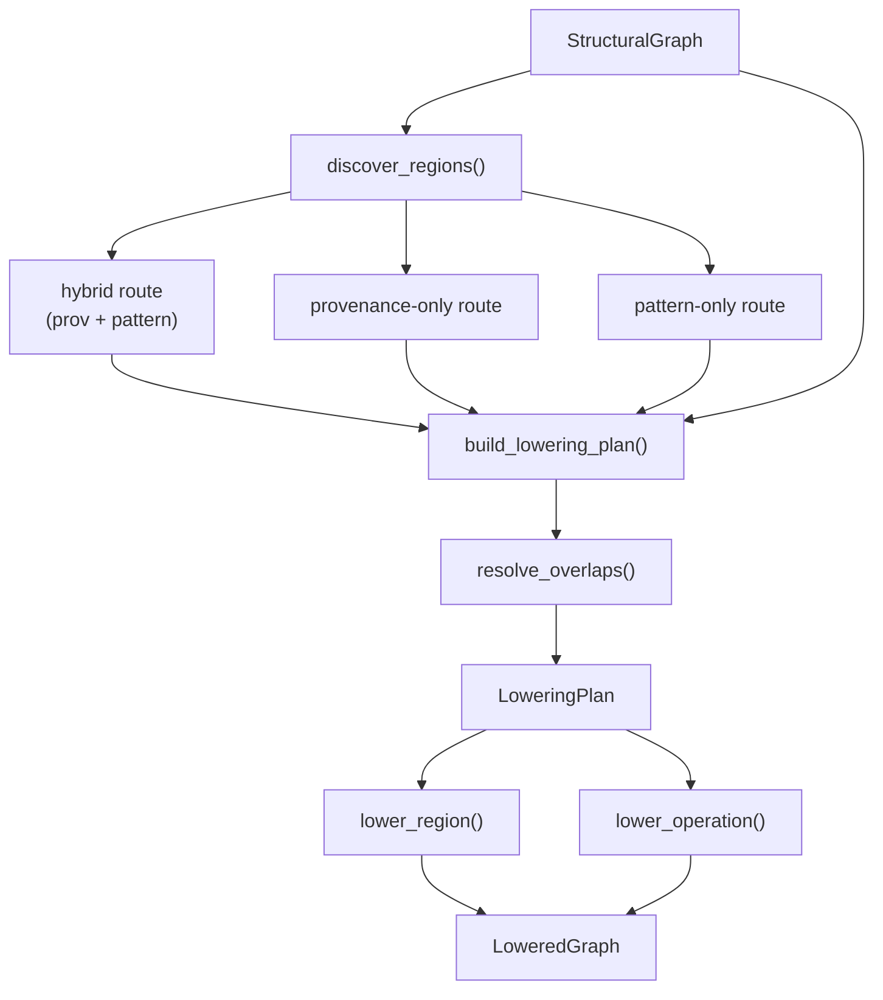
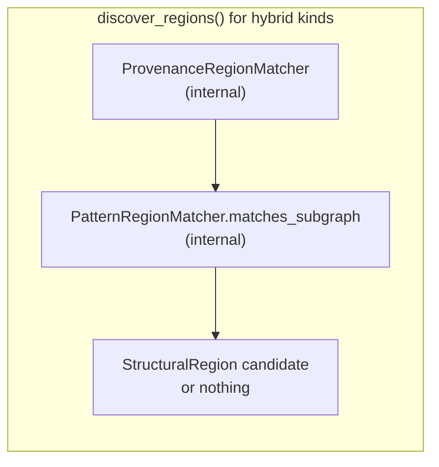

# Module-Aware Lowering Plan (Phase C)

Concrete implementation plan for linking **lowered implementations** to **modules**
without making modules computational nodes in the structural graph. Phase C adds a
**planner-driven lowering pass** that can optionally fuse structural operations
into region-level lowered nodes, while preserving the existing per-operation
lowering route as the default fallback.

This plan assumes Phase A (parameter plumbing) is complete and Phase B (real
module compositions such as `LayerNorm`) may be in progress elsewhere. Phase C
does **not** implement estimation reports (`account_memory`, `account_flops`) —
that is Phase D.

---

## Goals

| Goal | Success criterion |
|------|-------------------|
| Unified lowering dataflow | One `lower()` pass executes both region fusion and per-op lowering |
| Module link at lowering time | Lowered nodes carry `module_path` / `component_type` for attribution |
| Optional fusion | Fused kernels change lowered FLOPs/VRAM; aggregated modules work without fusion |
| Provenance-based regions | Ops under a module invocation can be grouped for fused lowering |
| Pattern-based regions | Op subgraph patterns (e.g. ReLU) fuse without module boundaries |
| Explicit fallback | When no fused impl matches, per-op identity lowering applies unchanged |
| Audit trail | Region selections record chosen/rejected implementations and reasons |

## Non-goals

- Changing structural graph semantics (modules remain provenance boundaries only)
- Persisting `StructuralRegion` on the structural graph at composition time
- Full fused kernels for every module (`MultiHeadAttention`, `FeedForward` aggregation
  works via per-op route only)
- `estimate()` / `MemoryReport` / `FlopReport` (Phase D)
- Horizon simulation (future)

---

## Architectural principles

1. **Structural graph is unchanged.** Every computational step remains a
   `StructuralOperation`. `StructuralRegion` is a lowering-time view, not a graph node.

2. **Two routes, one pass.** Region lowering (N→1) and operation lowering (1→1)
   are step kinds in a single `LoweringPlan`, not parallel systems.

3. **Cost authority stays on lowered nodes.** Modules do not declare FLOPs or
   VRAM. Fused region implementations declare execution cost; aggregated modules
   inherit cost from the sum of per-op lowered nodes.

4. **Fusion is opt-in.** No registered `RegionImplementation` → same behavior as
   today's `lower()`.

5. **Preserve graph order.** The plan walks `graph.operations` in eager composition
   order so resource event simulation remains deterministic.

---

## Overall dataflow

```text
User composition
    │
    ▼
StructuralGraph                    (immutable; StructuralOperation nodes only)
    │
    ▼
lower(graph, InvocationContext)
    │
    ├─ 1. Materialize graph inputs → tensor_map
    │
    ├─ 2. discover_regions(graph, context, registry)
    │       per registered RegionImplementation:
    │       ├─ both rules   → hybrid (envelope AND pattern)
    │       ├─ pattern only → PatternRegionMatcher
    │       └─ provenance only → ProvenanceRegionMatcher
    │       → tuple[StructuralRegion, ...]   (candidates; may overlap across kinds)
    │
    ├─ 3. build_lowering_plan(graph, regions, context, registry)
    │       ├─ resolve_overlaps()        → disjoint winning regions
    │       └─ walk graph.operations     → ordered LoweringSteps
    │       → LoweringPlan
    │
    ├─ 4. Execute plan
    │       ├─ region step  → RegionImplementation.lower()  (N→1)
    │       └─ operation step → Implementation.lower()        (1→1, existing)
    │
    └─ 5. assemble LoweredGraph
            → operations, tensor_map, operation_map,
              fusion_map, region_map, selections, region_selections
    │
    ▼
Phase D: account_memory / account_flops   (not in this plan)
```



---

## Component reference

Each subsection describes **why** the component exists, **what** it does in plain
words, and **proposed code**.

---

### 1. Composition prerequisites — stable provenance tagging

**File:** `src/zepto/core/composition.py`

**Importance:** Region matching keys on `Provenance.module_path` and
`Provenance.component_type`. Today `call_module()` pushes the Python class name
and never sets `component_type`, so provenance-based fusion cannot reliably
identify `LayerNorm` vs `Linear` invocations.

**Value:** Stable module identity at lowering time without adding structural nodes.

**Changes:**

```python
class Module:
    module_kind: ClassVar[str | None] = None  # defaults to class name when None

    @property
    def component_type(self) -> str:
        """Stable reportable kind for provenance and region matching."""
        return self.module_kind or self.__class__.__name__
```

Update `call_module()` to use registered submodule names when invoked through
`register_module`, and stamp `component_type` on every `apply()` inside
`forward()`:

```python
def call_module(
    self,
    module: Module,
    inputs: tuple[GraphTensor, ...],
    *,
    name: str | None = None,
) -> GraphTensor | tuple[GraphTensor, ...]:
    previous_path = self._module_path
    previous_component = self._component_type
    segment = name or module.component_type
    self._module_path = (*previous_path, segment)
    self._component_type = module.component_type
    try:
        return module.forward(*inputs)
    finally:
        self._module_path = previous_path
        self._component_type = previous_component
```

**Why the `try` / `finally` and the restore?**

`GraphCompositionContext` is a **stack of nested module invocations**, not a one-shot
call. When `Block.forward()` calls `self.norm(x)`, the context must:

1. **Push** the current module segment onto `_module_path` and set `_component_type`
   *before* `norm.forward()` runs, so every `apply()` inside that `forward()` stamps
   provenance under `("Block", "norm")` with `component_type="LayerNorm"`.
2. **Pop** (restore) those fields *after* `norm.forward()` returns, so subsequent
   ops in `Block.forward()` — or in an outer module — are **not** incorrectly tagged
   as belonging to `norm`.

The `finally` block guarantees restore even when `forward()` raises: without it, a
failed submodule call would leave `_module_path` / `_component_type` stuck on the
child, corrupting provenance for the rest of the graph build.

This mirrors how `call_module()` already saves and restores `_module_path` today;
Phase C adds the same push/pop for `_component_type`.

**Example (nested calls):**

```text
Root MLP.forward()
  _module_path = ()
  _component_type = None

  call_module(block, …)          # push → ("Block",), component_type="TransformerBlock"
    block.forward()
      call_module(norm, name="norm")   # push → ("Block","norm"), component_type="LayerNorm"
        norm.forward()
          apply(ReduceMean, …)   # provenance: path=("Block","norm"), type=LayerNorm ✓
      finally: restore → ("Block",), component_type="TransformerBlock"

      apply(Add, …)              # provenance: path=("Block",), not under norm ✓
  finally: restore → (), None
```

Extend `Provenance` stamping in `apply()`:

```python
provenance = Provenance(
    module_path=module_path or self._module_path,
    component_type=component_type or self._component_type,
    operation_family=operation.family,
    operation_instance=instance,
    source_label=source_label,
)
```

**Registered submodule names — why this is a separate issue**

Today, nested modules are invoked like this:

```python
class Block(Module):
    def __init__(self) -> None:
        super().__init__()
        self.norm = LayerNorm(512)
        self.register_module("norm", self.norm)   # registers under name "norm"

    def forward(self, x: GraphTensor) -> GraphTensor:
        return self.norm(x)   # typical PyTorch-style call
```

`Module.__call__` routes to `context.call_module(self, inputs)` with **no** registered
name. And the current `call_module()` implementation uses:

```python
name = module.__class__.__name__   # → "LayerNorm", not "norm"
self._module_path = (*previous_path, name)
```

So provenance becomes `module_path=(…, "LayerNorm")` instead of `(…, "norm")`.
Both are stable strings, but they differ in important ways:

| Path segment | Source | Problem |
|---|---|---|
| `"norm"` | `register_module("norm", …)` | Matches parameter paths (`block.norm.weight`), user mental model, module pins like `("Block","norm")` |
| `"LayerNorm"` | Python class name | Collides when two different registered fields use the same class; ignores the name the user chose |

**Concrete collision example:**

```python
class Block(Module):
    def __init__(self) -> None:
        self.pre_norm = LayerNorm(512)
        self.post_norm = LayerNorm(512)
        self.register_module("pre_norm", self.pre_norm)
        self.register_module("post_norm", self.post_norm)
```

With class-name paths, **both** submodules produce `…/LayerNorm` in provenance.
Region matching and Phase D attribution cannot distinguish `pre_norm` from
`post_norm`.

**What Phase C needs:** when the user writes `self.norm(x)`, lowering and reports
must see `module_path=(…, "norm")` — the name passed to `register_module`.

**Proposed fix — thin wrapper on registration:**

```python
class Module:
    def register_module(self, name: str, module: Module) -> None:
        if not name or name in self._parameters or name in self._modules:
            raise ValueError(f"Invalid or duplicate module member {name!r}")
        self._modules[name] = module
        # Bind registered name so __call__ can pass it to call_module
        module._registered_name = name

    def __call__(self, *inputs: GraphTensor) -> GraphTensor | tuple[GraphTensor, ...]:
        context = GraphCompositionContext.current()
        if context is None:
            raise GraphCompositionError(...)
        name = getattr(self, "_registered_name", None)
        return context.call_module(self, inputs, name=name)
```

Then `self.norm(x)` automatically becomes
`call_module(norm_module, (x,), name="norm")` without changing call-site syntax.

**Until that lands:** module authors can call explicitly:

```python
context = GraphCompositionContext.current()
return context.call_module(self.norm, (x,), name="norm")
```

That is more verbose but unblocks provenance correctness before the wrapper exists.

---

### 2. `StructuralRegion` — lowering-time region view

**File:** `src/zepto/core/lowering/region.py` (new)

**Importance:** The bridge object between structural ops and region-level
implementations. It is **not** stored on `StructuralGraph`.

**Value:** Gives fusion a well-defined unit of work: which ops, which boundary
tensors, which parameters, which module anchor — without mutating semantics.

```python
"""Lowering-time views over structural operation subgraphs."""

from __future__ import annotations

from dataclasses import dataclass

from ..ids import OperationId, ParameterId, TensorId
from ..provenance import Provenance


@dataclass(frozen=True, slots=True)
class StructuralRegion:
    """One candidate fusible slice of a structural graph."""

    id: str
    kind: str                              # registry key, e.g. "region/layernorm"
    anchor: Provenance                     # module boundary / pattern anchor
    operation_ids: tuple[OperationId, ...] # topo order within the region
    boundary_inputs: tuple[TensorId, ...]  # tensors flowing in from outside
    boundary_outputs: tuple[TensorId, ...] # tensors leaving the region
    parameter_ids: tuple[ParameterId, ...] # parameters referenced inside
    matcher_id: str                        # rule that produced this candidate
```

**Boundary computation:** For each op in `operation_ids`, collect input tensors
whose producer is outside the region → `boundary_inputs`. Collect output tensors
with consumers outside → `boundary_outputs`. Parameters referenced by any internal
op → `parameter_ids`.

---

### 3. Region match rules — declarative fusion eligibility

**File:** `src/zepto/core/lowering/region.py`

**Importance:** Rules decouple *finding* regions from *lowering* them. Each
registered `RegionImplementation` carries the rule(s) it satisfies.

**Value:** New fused kernels are added by registration, not by editing the planner.

```python
from dataclasses import dataclass
from typing import Literal, Protocol


@dataclass(frozen=True, slots=True)
class RegionMatchRule:
    """Base type for region discovery rules."""

    id: str
    kind: str                              # links to RegionImplementation.kind
    priority: int = 0


@dataclass(frozen=True, slots=True)
class ProvenanceMatchRule(RegionMatchRule):
    """Match all ops sharing a module invocation envelope."""

    component_type: str | None = None
    module_path_suffix: tuple[str, ...] = ()
    require_contiguous_in_graph_order: bool = True


@dataclass(frozen=True, slots=True)
class PatternConstraint:
    """Structural predicate on one matched operation."""

    kind: Literal[
        "right_operand_is_zero",
        "parameter_count",
        "min_rank",
    ]
    # constraint-specific fields as needed


@dataclass(frozen=True, slots=True)
class PatternMatchRule(RegionMatchRule):
    """Match a subgraph by operation pattern."""

    op_families: tuple[str, ...] = ()
    constraints: tuple[PatternConstraint, ...] = ()
    # Multi-op: ordered family sequence with dataflow edges between steps
    edge_constraints: tuple[tuple[int, int, str], ...] = ()
    # e.g. (0, 1, "output_to_input") means op[0].output feeds op[1].input
```

---

### 4. `ProvenanceRegionMatcher` — module envelope discovery

**File:** `src/zepto/core/lowering/matchers/provenance.py` (new)

**Mission:** Answer *"Which ops belong to this module invocation?"*

**Does not:** Validate that ops form a mathematically fusable subgraph.

**Value:** Enables module-scoped fusion (`LayerNorm`, `Linear`) and module-scoped
implementation pins. Enables Phase D attribution rollup by module path.

**Logic (plain words):**

1. Group all `StructuralOperation`s by `(module_path, component_type)`.
2. For each registered `ProvenanceMatchRule`, check whether the group's path
   suffix and component type match.
3. If `require_contiguous_in_graph_order`, keep only groups that appear as one
   contiguous block in `graph.operations` (no foreign ops interleaved).
4. Build a `StructuralRegion` with boundary tensors and internal parameters.

```python
class ProvenanceRegionMatcher:
    """Discover module-scoped regions from provenance metadata."""

    def __init__(self, rules: tuple[ProvenanceMatchRule, ...]) -> None:
        self._rules = rules

    def find(
        self,
        graph: StructuralGraph,
        context: InvocationContext,
    ) -> tuple[StructuralRegion, ...]:
        ...
```

**Example:** Six primitives inside `LayerNorm.forward()`, all with
`component_type="LayerNorm"` and `module_path=("Block", "norm")`, produce one
region with six `operation_ids`.

---

### 5. `PatternRegionMatcher` — subgraph pattern discovery

**File:** `src/zepto/core/lowering/matchers/pattern.py` (new)

**Mission:** Answer *"Where does this recognizable op pattern appear?"*

**Does not:** Know about module hierarchy. Same pattern in two places → two regions.

**Value:** Supports fusion that is defined by structure, not module boundaries.
Migrates today's `ReLUMaskImplementation.compatible()` inline checks into a
reusable matcher. Enables future patterns (e.g. attention DAG) without module wrappers.

**Logic (plain words):**

1. For **single-op patterns** (ReLU): scan `graph.operations`; for each op whose
   `operation_family` matches, evaluate `PatternConstraint`s (e.g. right operand
   is provably zero via `is_zero_operand()`).
2. For **multi-op patterns** (LayerNorm validation, attention): find connected
   chains or small DAGs inside a candidate op set where each step's `operation_family`
   matches the rule and dataflow edges hold (output of step *i* feeds input of
   step *j*).
3. Emit one `StructuralRegion` per match; `operation_ids` may be length 1 (ReLU).

**LayerNorm pattern rule (example)**

Assume Phase B decomposes affine layer norm into six primitives (family names
illustrative — adjust to whatever Phase B ships):

```text
input x
  → reduce_mean        (axis = normalized dim)
  → subtract           (x - mean)
  → multiply           (centered * centered  → variance term)
  → add                (+ epsilon)
  → sqrt
  → divide             (centered / std)
  → multiply           (× scale parameter)
  → add                (+ shift parameter)
```

Minimal six-op core (before affine params) might be:
`reduce_mean → subtract → … → divide`. The exact families depend on Phase B; the
**pattern rule** describes the shape, not the module.

**What `edge_constraints` mean**

Each entry is a triple `(from_index, to_index, edge_kind)`:

| Field | Meaning |
|---|---|
| `from_index` | Step in `op_families` that **produces** the tensor |
| `to_index` | Step in `op_families` that **consumes** it |
| `edge_kind` | Which port on the consumer the edge must connect to |

Indices refer to positions in `op_families` (0 = `reduce_mean`, 1 = `subtract`, …).
The matcher resolves real `OperationId`s by walking the structural graph's
producer/consumer links on tensors: an edge is satisfied when the output tensor
of `chain[from_index]` appears in the input port named by `edge_kind` on
`chain[to_index]`.

Supported `edge_kind` values (v1):

| `edge_kind` | Semantics |
|---|---|
| `output_to_input` | Producer's primary output → consumer's first input port |
| `output_to_second_input` | Producer's output → consumer's second input port |
| `output_to_parameter` | Producer output aliases a parameter port (rare) |

**Example — reading the LayerNorm edges:**

```text
op_families index:  0           1          2         3      4      5
                    reduce_mean → subtract → multiply → add → sqrt → divide

(0, 1, "output_to_input")   mean output is subtract's subtrahend (x - mean)
(1, 2, "output_to_input")   centered output feeds multiply (square for variance)
(2, 3, "output_to_input")   variance term feeds add (+ epsilon)
(3, 4, "output_to_input")   radicand feeds sqrt
(4, 5, "output_to_first_input")   std feeds divide denominator
(1, 5, "output_to_second_input")  centered (from subtract) feeds divide numerator
```

Without edge constraints, matching on `op_families` alone would accept six ops
with the right **names** but wrong **wiring** (e.g. a disconnected chain that
happens to appear in graph order).

```python
LAYERNORM_DECOMPOSED_PATTERN = PatternMatchRule(
    id="pat-layernorm-decomposed",
    kind="region/layernorm",
    priority=5,
    op_families=(
        "reduce_mean",
        "subtract",
        "multiply",   # square / variance
        "add",        # + epsilon
        "sqrt",
        "divide",
    ),
    edge_constraints=(
        (0, 1, "output_to_input"),          # mean → subtract (x - mean)
        (1, 2, "output_to_input"),          # centered → variance square
        (2, 3, "output_to_input"),          # variance → + epsilon
        (3, 4, "output_to_input"),          # radicand → sqrt
        (4, 5, "output_to_first_input"),    # std → divide denominator
        (1, 5, "output_to_second_input"),   # centered → divide numerator
    ),
    constraints=(
        PatternConstraint(kind="parameter_count", max_parameters=2),  # scale + shift optional
    ),
)
```

**How `PatternRegionMatcher` uses this rule:**

```python
def _match_sequence(self, graph: StructuralGraph, rule: PatternMatchRule) -> list[StructuralRegion]:
    """Find connected chains matching rule.op_families in graph.operations order
    or by explicit dataflow backtracking."""
    families = rule.op_families
    matches: list[StructuralRegion] = []

    for start_op_id in graph.operations:
        start = graph.operation(start_op_id)
        if start.operation_family != families[0]:
            continue

        chain = self._extend_chain(graph, start_op_id, families, rule.edge_constraints)
        if chain is None:
            continue

        region = self._build_pattern_region(graph, chain, rule)
        matches.append(region)

    return matches


def _extend_chain(
    self,
    graph: StructuralGraph,
    start_id: OperationId,
    families: tuple[str, ...],
    edges: tuple[tuple[int, int, str], ...],
) -> tuple[OperationId, ...] | None:
    """Greedy or backtracking walk: each next op must match families[i]
    and satisfy edge_constraints (producer output → consumer input)."""
    chain = [start_id]
    for i in range(1, len(families)):
        next_op = self._find_dataflow_successor(
            graph, chain[-1], expected_family=families[i], edges=edges, step=i
        )
        if next_op is None:
            return None
        chain.append(next_op)
    return tuple(chain)
```

**Divide with two inputs:** `divide` is the only step with a fan-in from two
earlier steps. That is expressed as two edge constraints targeting index `5` —
one for each input port — rather than a single `output_to_input` edge.

**Standalone vs hybrid use:**

| Use | Matcher | Result |
|---|---|---|
| Pattern only | `PatternRegionMatcher` scans whole graph | Any six-op chain fuses, even outside a `LayerNorm` module |
| Hybrid (recommended for module fusion) | Pattern run **inside** provenance envelope | Only `LayerNorm` module invocations whose internals match the chain fuse |

The pattern rule is therefore a **structural validator** — it answers "does this
op sequence look like layer norm?" regardless of where it was composed.

```python
class PatternRegionMatcher:
    """Discover regions from operation subgraph patterns."""

    def __init__(self, rules: tuple[PatternMatchRule, ...]) -> None:
        self._rules = rules

    def find(
        self,
        graph: StructuralGraph,
        context: InvocationContext,
    ) -> tuple[StructuralRegion, ...]:
        ...

    def matches_subgraph(
        self,
        graph: StructuralGraph,
        operation_ids: tuple[OperationId, ...],
        rule: PatternMatchRule,
    ) -> bool:
        """Return whether an existing op set satisfies a pattern rule."""
        ...
```

**ReLU example:** Rule `op_families=("maximum",)`,
`constraints=(PatternConstraint("right_operand_is_zero"),)` → region of one op.

---

### 6. `discover_regions()` — matcher orchestrator

**File:** `src/vepto/core/lowering/discovery.py` (new)

**Importance:** Single entry point that collects all region candidates before
planning.

**Value:** Encodes the discovery policy in one place: **hybrid for module fusion,
pattern-only for op patterns, provenance-only when no pattern gate exists.**
Raw provenance envelopes and hybrid-refined regions are **never both emitted**
for the same kind.

**Discovery policy (v1):**

Each registered `RegionImplementation` declares zero or more of
`provenance_rule` and `pattern_rule`. Discovery routes by what is registered:

| Registration | Discovery route | Example |
|---|---|---|
| `provenance_rule` + `pattern_rule` | **Hybrid** — envelope AND internal pattern must match | Fused LayerNorm |
| `pattern_rule` only | **Pattern-only** — scan graph for pattern | ReLU |
| `provenance_rule` only | **Provenance-only** — module envelope suffices | Fused Linear (1 op) |

```python
def discover_regions(
    graph: StructuralGraph,
    context: InvocationContext,
    registry: LoweringRegistry,
) -> tuple[StructuralRegion, ...]:
    """Return region candidates according to each impl's registered rules."""
    candidates: list[StructuralRegion] = []

    for kind in registry.registered_region_kinds():
        descriptor = registry.region_descriptor(kind)
        prov_rule = descriptor.provenance_rule
        pat_rule = descriptor.pattern_rule

        if prov_rule is not None and pat_rule is not None:
            # Hybrid: emit ONLY when both provenance envelope and pattern pass
            candidates.extend(
                _discover_hybrid_regions(
                    graph, context, prov_rule, pat_rule
                )
            )
        elif pat_rule is not None:
            candidates.extend(
                PatternRegionMatcher((pat_rule,)).find(graph, context)
            )
        elif prov_rule is not None:
            candidates.extend(
                ProvenanceRegionMatcher((prov_rule,)).find(graph, context)
            )

    return tuple(candidates)
```

**Why not extend three separate lists?** An earlier sketch appended provenance
candidates, pattern candidates, *and* hybrid candidates. That contradicts the
"emit only when both pass" rule: raw provenance envelopes for LayerNorm would
enter the candidate pool even when the internal pattern fails, forcing
`resolve_overlaps()` to reject them later. It is clearer and safer to **never
emit** those envelopes at discovery time.

`_discover_hybrid_regions()` is the internal helper (formerly sketched as
`_hybrid_refine()`); it is not a third additive pass:

```python
def _discover_hybrid_regions(
    graph: StructuralGraph,
    context: InvocationContext,
    provenance_rule: ProvenanceMatchRule,
    pattern_rule: PatternMatchRule,
) -> tuple[StructuralRegion, ...]:
    """Provenance envelope gated by internal pattern match.

    Returns an empty tuple when the envelope exists but the pattern fails —
    those ops are not region candidates and will lower per-op.
    """
    provenance_matcher = ProvenanceRegionMatcher((provenance_rule,))
    pattern_matcher = PatternRegionMatcher((pattern_rule,))

    refined: list[StructuralRegion] = []
    for envelope in provenance_matcher.find(graph, context):
        if not pattern_matcher.matches_subgraph(
            graph, envelope.operation_ids, pattern_rule
        ):
            continue  # no candidate emitted

        refined.append(
            replace(
                envelope,
                kind=pattern_rule.kind,
                matcher_id=f"hybrid:{provenance_rule.id}+{pattern_rule.id}",
            )
        )
    return tuple(refined)
```

Matchers (`ProvenanceRegionMatcher`, `PatternRegionMatcher`) remain independent
implementations; `discover_regions()` orchestrates **which route to call** per
registered implementation rather than concatenating all routes blindly.

---

### 6a. Hybrid discovery — provenance scope + pattern gate

**Problem it solves:** `ProvenanceRegionMatcher` alone is **too permissive**. It
groups *all* ops under `(module_path, component_type="LayerNorm")` even when:

- Phase B has not landed and the module still calls `identity()` (one op)
- The internal decomposition changed (extra `reshape`, different reduce op)
- A bug leaves foreign ops inside the module path

Fusing those cases with a `FusedLayerNormRegionImplementation` would produce
**wrong FLOPs and VRAM** — the fused kernel assumes a specific math pattern.

`PatternRegionMatcher` alone is **too loose in a different direction**: it finds
every matching six-op chain in the graph, even if the user did not intend a
`LayerNorm` module boundary (e.g. manual norm math inlined in `forward()`).

**Hybrid discovery combines both — and emits a region ONLY when both pass:**

```text
ProvenanceRegionMatcher  →  "draw a box around this module invocation"  (internal)
PatternRegionMatcher     →  "verify the ops inside the box match the expected chain"  (internal)
discover_regions()       →  emit StructuralRegion candidate ONLY on success
```

Hybrid is **not** a third list appended to provenance and pattern results. It
**is** the discovery route for implementations that register both rules. See
§6 above.

**Relationship diagram:**



**Logic (plain words):**

1. For each region kind registered with **both** rules, run provenance matching
   to obtain envelope(s).
2. For each envelope, call `matches_subgraph(envelope.operation_ids, pattern_rule)`.
3. **Match** → emit one refined `StructuralRegion` candidate.
4. **No match** → emit **nothing**; ops lower per-op in `build_lowering_plan()`.

**Code:** See `_discover_hybrid_regions()` in §6 — same logic as previously
sketched under `_hybrid_refine()`, now the sole hybrid entry point called from
`discover_regions()`.

**Worked example — placeholder LayerNorm (Phase B not done):**

```text
Provenance envelope:  component_type="LayerNorm", ops = [identity]     (1 op)
Pattern rule:         expects 6 families [reduce_mean, subtract, …]
Hybrid result:        no match → no candidate emitted → identity lowers per-op ✓
```

**Worked example — real LayerNorm (Phase B done):**

```text
Provenance envelope:  6 ops under ("Block","norm"), component_type="LayerNorm"
Pattern rule:         6-op chain matches
Hybrid result:        one candidate region → eligible for FusedLayerNormRegionImplementation ✓
```

**Worked example — ReLU (pattern-only kind):**

```text
Registration:         pattern_rule only (no provenance_rule)
Discovery route:        PatternRegionMatcher.find() directly — no hybrid step
```

**What reaches `build_lowering_plan()`:**

| Discovery route | When used | Candidate emitted? |
|---|---|---|
| Hybrid | Both rules registered (LayerNorm) | Only if envelope **and** pattern pass |
| Pattern-only | Pattern rule only (ReLU) | When pattern matches anywhere in graph |
| Provenance-only | Provenance rule only (1-op Linear) | When module envelope matches |

**Registration examples:**

- `FusedLayerNormRegionImplementation` — **both** rules → hybrid route in
  `discover_regions()`.
- `ReLURegionImplementation` — **pattern_rule only** → pattern route.
- `FusedLinearRegionImplementation` — **provenance_rule only** (single
  `linear_matmul` op; no pattern gate needed) → provenance route.

This keeps module fusion safe (pattern-gated) while keeping op-pattern fusion
simple (ReLU stays pattern-only).

---

### 7. `LoweringPlan` and `build_lowering_plan()` — schedule construction

**File:** `src/zepto/core/lowering/plan.py` (new)

**Importance:** Converts overlapping candidates into a non-overlapping, ordered
execution schedule.

**Value:** Makes fusion auditable; guarantees each structural op is lowered
exactly once; preserves eager graph order for memory simulation.

```python
from dataclasses import dataclass
from typing import Literal, Mapping


@dataclass(frozen=True, slots=True)
class LoweringStep:
    """One step in the lowering schedule."""

    kind: Literal["region", "operation"]
    region: StructuralRegion | None = None
    operation_id: OperationId | None = None


@dataclass(frozen=True, slots=True)
class LoweringPlan:
    """Non-overlapping lowering schedule."""

    steps: tuple[LoweringStep, ...]
    consumed: frozenset[OperationId]
    region_by_op: Mapping[OperationId, str]
```

**`build_lowering_plan()` logic (plain words):**

1. **`resolve_overlaps(candidates)`** — Sort candidates by:
   - explicit region/component pin in context (highest)
   - registered `RegionImplementation.priority`
   - region size (prefer larger fusion)
   - tie-break on matcher priority / stable id

   Greedily accept regions whose `operation_ids` do not intersect already-claimed
   ops. Skip a candidate when no compatible `RegionImplementation` exists and
   strict planning is enabled (recommended).

2. **Index winners** by first `operation_id` in each region.

3. **Walk `graph.operations` in order:**
   - If current op starts a winning region → emit one `region` step; mark all
     region ops consumed.
   - Else if op not consumed → emit one `operation` step.

```python
def build_lowering_plan(
    graph: StructuralGraph,
    regions: tuple[StructuralRegion, ...],
    context: InvocationContext,
    registry: LoweringRegistry,
) -> LoweringPlan:
    winners = resolve_overlaps(regions, context, registry)
    ...
```

**Fallback:** When a provenance region is found but no fused impl is compatible,
do **not** claim its ops during overlap resolution. Those ops receive per-op
`operation` steps — identical to today's behavior.

---

### 8. `RegionEstimationContext` — boundary port metadata for fusion

**File:** `src/zepto/core/lowering/helpers.py` (extend)

**Importance:** Per-op `build_estimation_context()` resolves one node's ports.
Region implementations need boundary-level metadata.

**Value:** Fused kernels compute FLOPs and emit resource events from module
inputs/outputs/parameters, not from every internal primitive.

```python
@dataclass(frozen=True, slots=True)
class RegionEstimationContext:
    """Aggregated port metadata for one structural region."""

    region: StructuralRegion
    phase: str
    input_metadata: Mapping[str, ValueMetadata]
    output_metadata: Mapping[str, ValueMetadata]
    parameter_metadata: Mapping[str, ValueMetadata]
    precision: PrecisionPolicy | None
    state: tuple[tuple[str, object], ...]


def build_region_estimation_context(
    region: StructuralRegion,
    graph: StructuralGraph,
    context: InvocationContext,
) -> RegionEstimationContext:
    """Resolve boundary tensor and parameter metadata for a region."""
    ...
```

Boundary inputs: metadata of `boundary_inputs` tensors. Boundary outputs: metadata
of final output tensors produced by the last op(s) in the region. Parameters:
`bound_parameter_metadata()` for each `parameter_ids` entry.

---

### 9. `RegionImplementation` — N→1 lowering protocol

**File:** `src/zepto/core/lowering/registry.py` (extend)

**Importance:** The execution-strategy counterpart to `Implementation`, but for
`StructuralRegion` instead of `StructuralOperation`.

**Value:** Fused kernels declare their own FLOPs, backward FLOPs, and resource
events — including elided intermediate allocations.

```python
@dataclass(frozen=True, slots=True)
class RegionImplementationDescriptor:
    id: str
    kind: str
    priority: int = 0
    capabilities: frozenset[str] = frozenset()
    requires: frozenset[str] = frozenset()
    provenance_rule: ProvenanceMatchRule | None = None
    pattern_rule: PatternMatchRule | None = None


@dataclass(frozen=True, slots=True)
class RegionImplementationSelection:
    region_id: str
    structural_operation_ids: tuple[OperationId, ...]
    chosen: RegionImplementationDescriptor
    rejected: tuple[tuple[RegionImplementationDescriptor, str], ...]
    reason: str


class RegionImplementation(Protocol):
    @property
    def descriptor(self) -> RegionImplementationDescriptor: ...

    def compatible(
        self,
        region: StructuralRegion,
        graph: StructuralGraph,
        context: InvocationContext,
    ) -> str | None: ...

    def lower(
        self,
        region: StructuralRegion,
        graph: StructuralGraph,
        context: InvocationContext,
        tensor_map: dict,
        *,
        estimation: RegionEstimationContext,
        lowered_tensors: dict,
    ) -> LoweredOperation: ...
```

**Accounting modes:**

| Mode | FLOPs | VRAM | When |
|------|-------|------|------|
| **Declared** | Closed-form from boundary shapes | Explicit ALLOCATE/SAVE/WORKSPACE | True fused kernel |
| **Derived** | Sum of internal op contracts | Rewrite events to elide internal ALLOCATEs | Fallback wrapper / validation |

Aggregated modules (MHA, FFN) use neither — they stay on the per-op route.

---

### 10. `select_region_implementation()` — region selection

**File:** `src/zepto/core/lowering/registry.py`

**Importance:** Mirrors `select_implementation()` for regions with the same pin /
compatibility / priority semantics.

**Value:** Reproducible, auditable fusion choices aligned with ADR 0002.

```python
def select_region_implementation(
    region: StructuralRegion,
    graph: StructuralGraph,
    context: InvocationContext,
    registry: LoweringRegistry,
) -> tuple[RegionImplementation, RegionImplementationSelection]:
    candidates = registry.region_candidates(region.kind)
    # 1. region pin / component_type pin
    # 2. filter by compatible()
    # 3. filter by requested_capabilities (NOW USED for regions)
    # 4. sort by priority, pick highest
    ...
```

**Selection precedence (full pass):**

```text
region_implementation_pins[kind]
    → module_implementation_pins[component_type]
    → capability-filtered region candidates by priority
    → (fallback) per-op route for uncovered ops
        → implementation_pins[family]
        → per-op candidates by priority
```

---

### 11. Extended `InvocationContext` — module-scoped pins

**File:** `src/zepto/core/lowering/context.py`

**Importance:** Users must be able to pin fused kernels per module kind or region
family, not only per operation family.

**Value:** Reproducible research estimates ("always use fused LayerNorm on CUDA").

```python
@dataclass(frozen=True, slots=True)
class InvocationContext:
    ...
    implementation_pins: Mapping[str, str] = MappingProxyType({})
    module_implementation_pins: Mapping[str, str] = MappingProxyType({})
    region_implementation_pins: Mapping[str, str] = MappingProxyType({})
    requested_capabilities: frozenset[str] = frozenset()
    allow_fallback: bool = True
```

Update `reference_context()` to accept the new pin mappings.

---

### 12. Extended `LoweredOperation` and `LoweredGraph` — attribution maps

**File:** `src/zepto/core/lowered.py`

**Importance:** Phase D reports need to know which lowered nodes belong to which
module, and which structural ops were absorbed by fusion.

**Value:** Module-attributed FLOP/VRAM without re-walking heuristics.

```python
@dataclass(frozen=True, slots=True)
class LoweredOperation:
    id: str
    structural_operation_ids: tuple[OperationId, ...]  # was: single id
    implementation: str
    module_path: tuple[str, ...] = ()
    component_type: str | None = None
    region_id: str | None = None
    input_tensors: tuple[str, ...]
    output_tensors: tuple[str, ...]
    auxiliary_tensors: tuple[str, ...]
    resource_events: tuple[ResourceEvent, ...]
    forward_flops: int
    backward_flops: int
    auxiliary_metadata: Mapping[str, ValueMetadata] = MappingProxyType({})

    @property
    def structural_operation_id(self) -> OperationId:
        """Backward-compatible single-op accessor."""
        return self.structural_operation_ids[0]


@dataclass(frozen=True, slots=True)
class LoweredGraph:
    ...
    fusion_map: Mapping[OperationId, str] = MappingProxyType({})
    region_map: Mapping[str, tuple[OperationId, ...]] = MappingProxyType({})
    region_selections: tuple[RegionImplementationSelection, ...] = ()
```

**Backward compatibility:** Keep `structural_operation_id` as a property returning
the first id; update `operation_map` to map every absorbed op id → lowered op id.

---

### 13. Refactored `lower()` — planner-driven unified pass

**File:** `src/zepto/core/lowering/transform.py`

**Importance:** Replaces the naive per-op loop with plan execution while
extracting today's body into `lower_operation()`.

**Value:** Single coherent dataflow; both routes share `tensor_map` and
`lowered_tensors` state.

```python
@dataclass
class LoweringState:
    lowered_tensors: dict[str, LoweredTensor]
    tensor_map: dict[TensorId, str]
    operations: list[LoweredOperation]
    operation_map: dict[OperationId, str]
    fusion_map: dict[OperationId, str]
    region_map: dict[str, tuple[OperationId, ...]]
    selections: list[ImplementationSelection]
    region_selections: list[RegionImplementationSelection]
    consumed: set[OperationId]


def lower(
    graph: StructuralGraph,
    context: InvocationContext,
    *,
    registry: LoweringRegistry | None = None,
) -> LoweredGraph:
    active_registry = registry or DEFAULT_REGISTRY
    state = LoweringState(...)

    for input_id in graph.inputs:
        ensure_lowered_tensor(input_id, graph, context, state.lowered_tensors, state.tensor_map)

    regions = discover_regions(graph, context, active_registry)
    plan = build_lowering_plan(graph, regions, context, active_registry)

    for step in plan.steps:
        if step.kind == "region":
            assert step.region is not None
            lower_region(step.region, graph, context, active_registry, state)
        else:
            assert step.operation_id is not None
            lower_operation(step.operation_id, graph, context, active_registry, state)

    return assemble_lowered_graph(graph, context, state)


def lower_operation(...) -> None:
    """Existing 1→1 path extracted unchanged."""
    ...


def lower_region(...) -> None:
    """New N→1 path."""
    impl, selection = select_region_implementation(region, graph, context, registry)
    estimation = build_region_estimation_context(region, graph, context)
    # materialize boundary tensors via ensure_lowered_tensor
    lowered_op = impl.lower(region, graph, context, state.tensor_map, estimation=estimation, ...)
    ...
```

---

### 14. Extended `LoweringRegistry` — dual indexing

**File:** `src/zepto/core/lowering/registry.py`

**Importance:** One registry holds both operation and region implementations plus
their discovery rules.

**Value:** Registration of a fused kernel automatically enables its matcher rules.

```python
class LoweringRegistry:
    def __init__(self) -> None:
        self._by_id: dict[str, Implementation | RegionImplementation] = {}
        self._by_family: dict[str, list[Implementation]] = {}
        self._by_region_kind: dict[str, list[RegionImplementation]] = {}
        self._provenance_rules: list[ProvenanceMatchRule] = []
        self._pattern_rules: list[PatternMatchRule] = []

    def register(self, implementation: Implementation) -> None: ...

    def register_region(self, implementation: RegionImplementation) -> None:
        descriptor = implementation.descriptor
        ...
        if descriptor.provenance_rule is not None:
            self._provenance_rules.append(descriptor.provenance_rule)
        if descriptor.pattern_rule is not None:
            self._pattern_rules.append(descriptor.pattern_rule)

    def provenance_rules(self) -> tuple[ProvenanceMatchRule, ...]: ...
    def pattern_rules(self) -> tuple[PatternMatchRule, ...]: ...
    def region_candidates(self, kind: str) -> tuple[RegionImplementation, ...]: ...
```

---

### 15. First region implementations — proof path

**Files:** `src/zepto/core/lowering/implementations/regions/` (new)

Implement in this order:

#### 15.1 `ReLURegionImplementation` (migrate existing)

**Value:** Proves pattern route + unified planner with smallest possible region (1 op).
Replaces inline `ReLUMaskImplementation.compatible()` checks with `PatternRegionMatcher`.

```python
RELU_REGION = ReLURegionImplementation(
    descriptor=RegionImplementationDescriptor(
        id="region/relu",
        kind="region/relu",
        priority=10,
        capabilities=frozenset({"relu", "mask_retention"}),
        pattern_rule=PatternMatchRule(
            id="pat-relu",
            kind="region/relu",
            op_families=("maximum",),
            constraints=(PatternConstraint(kind="right_operand_is_zero"),),
        ),
    ),
)
```

Keep `IdentityImplementation` for generic `maximum` on the per-op fallback route.

#### 15.2 `FusedLinearRegionImplementation` (single-op + provenance)

**Value:** Proves provenance route with region size 1 before multi-op fusion.
Matches `component_type="Linear"` around a single `linear_matmul` op.

#### 15.3 `FusedLayerNormRegionImplementation` (multi-op + provenance)

**Value:** Proves N→1 fusion with elided intermediate VRAM. Requires Phase B
LayerNorm decomposition to exist in structural graphs.

Declared accounting example:

```python
def lower(self, region, graph, context, tensor_map, *, estimation, lowered_tensors):
    x_meta = estimation.input_metadata["input"]
    n = numel(x_meta)
    forward_flops = 5 * n   # mean, var, normalize, scale, shift — illustrative
    backward_flops = ...    # depends on saved stats vs recompute policy
    events = (
        ResourceEvent(ALLOCATE, output),
        ResourceEvent(ALLOCATE, saved_mean),
        ResourceEvent(SAVE, saved_mean),
        ...
    )
    return LoweredOperation(
        id=f"region:{region.id}",
        structural_operation_ids=region.operation_ids,
        implementation=self.descriptor.id,
        module_path=region.anchor.module_path,
        component_type=region.anchor.component_type,
        region_id=region.id,
        ...
    )
```

---

## How aggregated modules work (no region required)

`MultiHeadAttention` and `FeedForwardNetwork` are **aggregation modules**: they
compose many primitives but do not require fusion for correct costing.

```text
MHA module forward()
    → 20 StructuralOperations (each with provenance.module_path=("Block","attn"))
    → discover_regions: no matching RegionImplementation registered
    → build_lowering_plan: 20 operation steps
    → 20 LoweredOperations via IdentityImplementation
    → Phase D sums FLOPs/VRAM; attributes to ("Block","attn") via provenance
```

Fusion for attention (FlashAttention-style) is a **later optional**
`RegionImplementation` with a hybrid provenance + pattern rule — same pipeline,
extra plan step.

---

## Implementation order

```text
Phase C0  Provenance tagging (component_type, registered module names)
   ↓
Phase C1  Core types: StructuralRegion, match rules, LoweringPlan
   ↓
Phase C2  Matchers: ProvenanceRegionMatcher, PatternRegionMatcher, discover_regions
   ↓
Phase C3  Planner: resolve_overlaps, build_lowering_plan
   ↓
Phase C4  Region protocol: RegionImplementation, select_region_implementation,
          RegionEstimationContext, registry extensions
   ↓
Phase C5  Refactor lower(): LoweringState, lower_operation, lower_region, assemble
   ↓
Phase C6  Extend LoweredOperation / LoweredGraph / InvocationContext
   ↓
Phase C7  First impls: ReLU migration, FusedLinear (1-op), FusedLayerNorm (N-op)
   ↓
Phase C8  Tests (see below)
```

Each phase is independently mergeable. After C5 with no region impls registered,
behavior must match today's test suite exactly.

---

## File change summary

| File | Change |
|------|--------|
| `src/zepto/core/composition.py` | `module_kind`, `component_type`, fix `call_module` naming |
| `src/zepto/core/lowering/region.py` | **New** — `StructuralRegion`, match rules |
| `src/zepto/core/lowering/matchers/provenance.py` | **New** — `ProvenanceRegionMatcher` |
| `src/zepto/core/lowering/matchers/pattern.py` | **New** — `PatternRegionMatcher` |
| `src/zepto/core/lowering/discovery.py` | **New** — `discover_regions()` |
| `src/zepto/core/lowering/plan.py` | **New** — `LoweringPlan`, `build_lowering_plan()` |
| `src/zepto/core/lowering/registry.py` | Region protocol, selection, dual registry |
| `src/zepto/core/lowering/context.py` | Module/region pins |
| `src/zepto/core/lowering/helpers.py` | `RegionEstimationContext`, boundary helpers |
| `src/zepto/core/lowering/transform.py` | Planner-driven `lower()`, `lower_region()` |
| `src/zepto/core/lowered.py` | Extended operation/graph attribution fields |
| `src/zepto/core/lowering/implementations/regions/` | **New** — fused kernel impls |
| `src/zepto/core/lowering/implementations/maximum.py` | Deprecate inline ReLU compat (after migration) |
| `src/zepto/core/lowering/defaults.py` | Register region implementations |
| `src/zepto/core/lowering/__init__.py` | Export new public types |
| `tests/test_region_lowering.py` | **New** — Phase C tests |
| `tests/test_lowering.py` | Update for ReLU migration; regression |

---

## Tests

**New file:** `tests/test_region_lowering.py`

```python
def test_discover_provenance_region_groups_layernorm_ops() -> None: ...

def test_discover_pattern_region_finds_relu() -> None: ...

def test_build_plan_fuses_contiguous_layernorm_block() -> None: ...

def test_build_plan_fallback_when_no_region_impl() -> None: ...

def test_overlap_resolution_prefers_larger_region() -> None: ...

def test_lower_region_marks_ops_consumed_no_double_lowering() -> None: ...

def test_fusion_map_maps_absorbed_ops_to_region_lowered_op() -> None: ...

def test_module_path_on_lowered_operation_from_region() -> None: ...

def test_mha_without_fusion_lowers_per_op_only() -> None: ...

def test_region_pin_selects_descriptor() -> None: ...

def test_fused_layernorm_elides_internal_allocations_vs_identity_sum() -> None: ...
```

**Regression:** All existing `tests/test_lowering.py` tests pass after ReLU
migration (same lowered shape, now via region route).

---

## Design decisions

| Decision | Reason |
|----------|--------|
| `StructuralRegion` is lowering-time only | Preserves "modules are not computational nodes" (CONTEXT.md) |
| Two matchers, one planner | Provenance = scope; pattern = shape; hybrid combines both |
| Strict overlap resolution at plan time | Avoid plan steps that cannot be lowered |
| `allow_fallback` skips unlowerable regions | Uncovered ops use existing per-op route |
| Same `LoweredOperation` type for both routes | Phase D accounting stays uniform |
| Declared accounting for fused kernels | Fusion changes VRAM; cannot sum identity lowerings |
| ReLU migrated first | Smallest proof of pattern route before N→1 module fusion |
| Provenance tagging prerequisite | Without `component_type`, module fusion is unreliable |

---

## What Phase C unlocks

1. **Phase D attribution:** Roll up FLOPs/VRAM to `module_path` via
   `LoweredOperation.module_path` and `fusion_map`.
2. **Backend-specific fused estimates:** Register `region/cuda-layernorm` vs
   `region/reference-layernorm` with different resource events.
3. **FlashAttention-style fusion:** Add `RegionImplementation` + hybrid matcher
   without changing the structural graph or planner shape.
4. **Research reproducibility:** Module/region pins in `InvocationContext` with
   full selection audit trail.

---

## Checklist

- [ ] `component_type` stamped on provenance; registered submodule names in path
- [ ] `StructuralRegion` + match rule types
- [ ] `ProvenanceRegionMatcher` + `PatternRegionMatcher`
- [ ] `discover_regions()`
- [ ] `LoweringPlan` + `build_lowering_plan()` + `resolve_overlaps()`
- [ ] `RegionImplementation` protocol + `select_region_implementation()`
- [ ] `RegionEstimationContext` + `build_region_estimation_context()`
- [ ] Extended `LoweringRegistry` (region index + rules)
- [ ] Extended `InvocationContext` pins
- [ ] Refactored planner-driven `lower()`
- [ ] Extended `LoweredOperation` / `LoweredGraph` attribution maps
- [ ] ReLU migrated to region route
- [ ] Fused Linear (1-op provenance) proof
- [ ] Fused LayerNorm (N-op provenance) proof
- [ ] `tests/test_region_lowering.py` passes
- [ ] Full test suite passes (no regression on per-op-only graphs)
