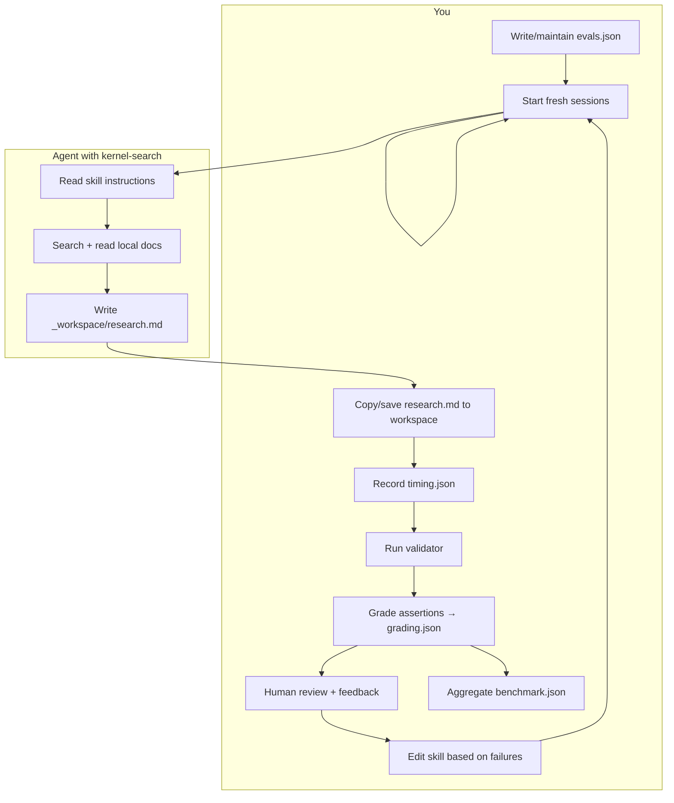

The eval workflow follows a convention from [agentskills.io](https://agentskills.io/skill-creation/evaluating-skills). In your repo today, only part of it is automated. Here is how the pieces fit together.

## What you author vs what gets produced

| File | Who creates it | When |
|------|----------------|------|
| `evals/evals.json` | **You** (once, then edit) | Before any eval run — prompts, expected outputs, assertions |
| `outputs/research.md` | **Agent** (you orchestrate) | During each eval run |
| `timing.json` | **You** (manual today) | Right after each run completes |
| `grading.json` | **You or an agent you prompt** | After reading `research.md` and running the validator |
| `benchmark.json` | **You** (manual today) | After all evals in an iteration are graded |

Nothing in your repo auto-writes `timing.json`, `grading.json`, or `benchmark.json` yet. The README describes the target layout; you fill those in (or ask an agent to produce them in a grading pass).

The only automated check you have now is:

```bash
python3 .pi/skills/kernel-search/scripts/validate_research.py <path-to-research.md>
```

That is a subset of assertion grading (structure, YAML, URLs) — not the full eval loop.

---

## Roles: you vs agent



**Agent job:** execute one prompt and produce a research report.

**Your job:** define tests, run them in clean sessions, measure, grade, decide skill changes, repeat.

The agent does not “run evals” end-to-end unless you explicitly ask it to grade outputs or write JSON artifacts.

---

## Full evaluation procedure (one iteration)

### Phase 0 — Setup (you, once)

1. Ensure `evals/evals.json` has your test prompts and assertions.
2. Create a gitignored workspace, e.g. `.pi/skills/kernel-search-workspace/`.
3. Optionally snapshot the current skill before edits:
   ```bash
   cp -r .pi/skills/kernel-search .pi/skills/kernel-search-v0.2-snapshot
   ```

---

### Phase 1 — Run each eval (you start, agent executes)

For **each** entry in `evals.json` (e.g. `xielu-leaf`):

#### Step 1a: With-skill run

1. Open a **fresh session** (no prior skill-editing context).
2. Give the agent the eval prompt and skill activation, e.g.:
   > Run kernel-search. Prompt: “Research xIELU for Zepto…” Write the report to `_workspace/research.md`.
3. Let the agent finish.
4. **You** copy the report into the eval workspace:
   ```
   .pi/skills/kernel-search-workspace/iteration-1/eval-xielu-leaf/with_skill/outputs/research.md
   ```

#### Step 1b: Baseline run (same prompt, no skill)

Repeat in another fresh session **without** activating `kernel-search` (or point at an old skill snapshot). Save to:

```
.../eval-xielu-leaf/without_skill/outputs/research.md
```

Baseline answers: “Does the skill actually help?” On later iterations, compare against `old_skill/` instead of `without_skill/`.

#### Step 1c: Record timing (you, manual)

After each run, create `timing.json` next to the outputs:

```json
{
  "total_tokens": 84852,
  "duration_ms": 23332,
  "model": "optional-model-id",
  "notes": "optional"
}
```

**When:** immediately after the run, while the session still shows token/time stats.

**Why:** compare cost of with-skill vs baseline. A skill that fixes FLOP errors but triples tokens may still be worth it — but you want the data.

If your UI does not expose tokens/duration, skip or note `"total_tokens": null` — the file is still useful as a placeholder.

---

### Phase 2 — Validate (automated + you)

For each `research.md`:

```bash
python3 .pi/skills/kernel-search/scripts/validate_research.py \
  .pi/skills/kernel-search-workspace/iteration-1/eval-xielu-leaf/with_skill/outputs/research.md
```

- **Script:** checks headings, YAML parse, bibliography URL, TBD-in-FLOP lines.
- **You:** fix obvious issues or note them for skill improvement.

Run the same on `without_skill/outputs/research.md` for comparison.

---

### Phase 3 — Grade assertions (you or grading agent)

Assertions in `evals.json` are mostly **domain checks** the validator cannot do (e.g. “bills 5× softmax leaf”).

For each assertion, decide PASS/FAIL with **evidence** (quote from the report). Write `grading.json`:

```
.../eval-xielu-leaf/with_skill/grading.json
.../eval-xielu-leaf/without_skill/grading.json
```

Example:

```json
{
  "eval_id": "xielu-leaf",
  "configuration": "with_skill",
  "assertion_results": [
    {
      "text": "Forward FLOP derivation uses a step table before closed form",
      "passed": true,
      "evidence": "Section 4.1 table lists 4 steps with running subtotal before closed form at line 89"
    },
    {
      "text": "YAML block includes region_kind and resource_events_forward",
      "passed": false,
      "evidence": "Section 8 YAML has region_kind: xielu but resource_events_forward is empty"
    }
  ],
  "validator": {
    "passed": false,
    "errors": ["Section 9 bibliography must contain at least one https:// URL"]
  },
  "summary": {
    "passed": 3,
    "failed": 2,
    "total": 5,
    "pass_rate": 0.6
  }
}
```

**How to grade:**

| Method | When to use |
|--------|-------------|
| **You read the report** | First iteration; builds intuition |
| **Ask an agent** | “Grade these assertions against this file; output grading.json” — faster at scale |
| **Script only** | Structural checks via `validate_research.py` — partial |

**When:** after validation, before changing the skill.

**Principle:** require evidence for PASS; do not give benefit of the doubt.

---

### Phase 4 — Human review (you)

Skim each `research.md` for things assertions miss:

- Wrong FLOP convention but phrased plausibly
- Missing search / stale citations
- Good structure, wrong Zepto semantics

Optional `feedback.json` at iteration level:

```json
{
  "eval-xielu-leaf": "Used 3× softmax without paper-comparable label.",
  "eval-masked-softmax-b": "",
  "eval-gqa-flash-decode": "Forgot paged KV decode specifics."
}
```

Empty string = acceptable output.

---

### Phase 5 — Aggregate benchmark (you, manual)

After all evals are graded, write:

```
.pi/skills/kernel-search-workspace/iteration-1/benchmark.json
```

Example:

```json
{
  "iteration": 1,
  "skill_version": "0.2",
  "run_summary": {
    "with_skill": {
      "pass_rate": { "mean": 0.73, "per_eval": { "xielu-leaf": 0.6, "masked-softmax-b": 0.8, "gqa-flash-decode": 0.8 } },
      "validator_pass_rate": { "mean": 0.67 },
      "time_seconds": { "mean": 120 },
      "tokens": { "mean": 45000 }
    },
    "without_skill": {
      "pass_rate": { "mean": 0.27 },
      "validator_pass_rate": { "mean": 0.33 },
      "time_seconds": { "mean": 90 },
      "tokens": { "mean": 28000 }
    },
    "delta": {
      "pass_rate": 0.46,
      "tokens": 17000
    }
  }
}
```

**When:** once per iteration, after all `grading.json` files exist.

**Purpose:** see whether the skill improves pass rate enough to justify extra tokens/time.

---

### Phase 6 — Improve the skill (you, optionally with an agent)

Use three signal sources:

1. **Failed assertions** → specific gaps (edit `references/gotchas.md`, workflow in `SKILL.md`)
2. **Validator failures** → template or validator rules
3. **Human feedback** → broader quality issues

Then start **iteration-2**: re-run all evals into a new folder, baseline = snapshot of iteration-1 skill.

Stop when pass rate plateaus and feedback is mostly empty.

---

## End-to-end checklist (iteration 1)

```
□ evals.json ready
□ workspace/iteration-1/ created

For each eval id:
  □ Fresh session → with_skill → save research.md
  □ Record timing.json
  □ Fresh session → without_skill → save research.md
  □ Record timing.json
  □ Run validate_research.py on both
  □ Write grading.json for both (with evidence)
  □ Human review → feedback.json (optional)

□ Write benchmark.json
□ Edit skill based on failures
□ iteration-2/ ...
```

---

## What could be automated later

Today everything after “agent writes report” is manual or ad-hoc. A future `scripts/run_evals.sh` or grading agent could:

- Copy outputs to the workspace layout
- Run the validator and embed results in `grading.json`
- LLM-grade assertions from `evals.json`
- Compute `benchmark.json` from all `grading.json` + `timing.json`

That automation does not exist yet — which is why the docs mention those files as **artifacts you produce** during the eval process.

---

## Practical first run (minimal)

If a full iteration feels heavy, start smaller:

1. Run **one** eval (`masked-softmax-b`) with skill only.
2. Run `validate_research.py`.
3. Grade its 5 assertions by hand → one `grading.json`.
4. Fix the skill for the top failure.
5. Re-run the same eval → compare pass rate.

That is a valid eval loop; `benchmark.json` and baseline runs become important once you want to prove the skill beats no-skill or an older version.

If you want, I can add a `scripts/grade_eval.py` that runs the validator and scaffolds empty `grading.json` / `benchmark.json` from `evals.json` — still leaving domain assertions for you or a grading agent to fill in.
